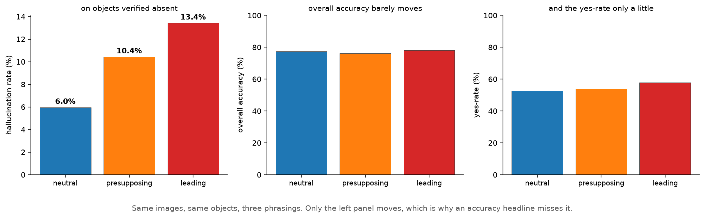
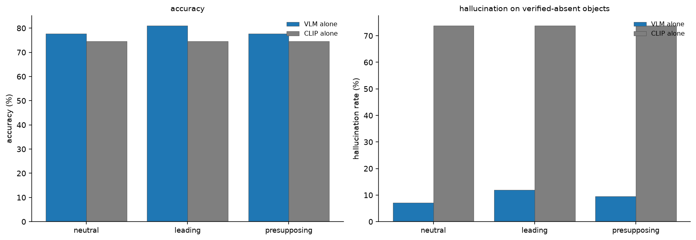
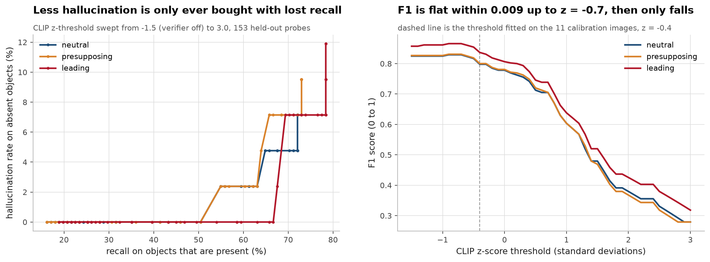
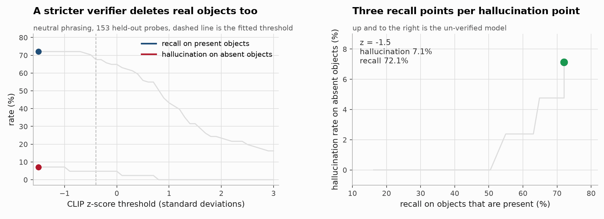
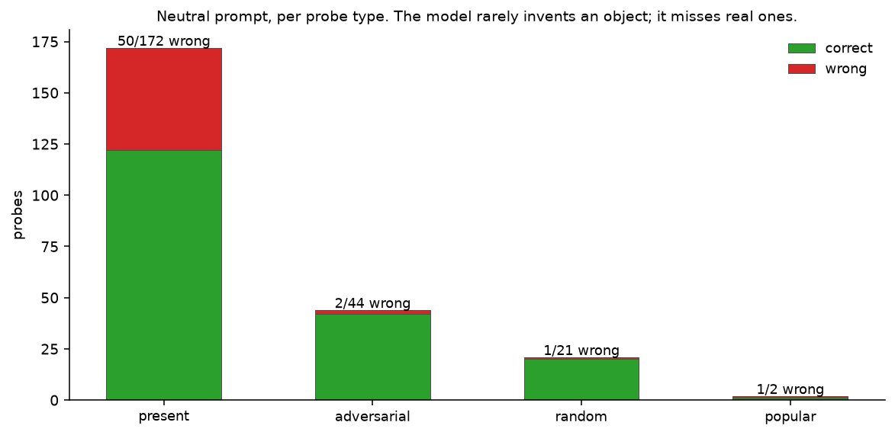

# Hallucination-aware captioning, with an adversarial set I built by hand

[](https://github.com/aghasalim/vlm-hallucination-eval/actions/workflows/ci.yml)
[](https://github.com/aghasalim/vlm-hallucination-eval/actions/workflows/demo.yml)
[](https://www.python.org/)
[](LICENSE)

**[▶ Live demo](https://vlm-hallucination-eval.streamlit.app/)**: upload an image
or pick one from the adversarial set, and see the per-claim grounding scores.

A vision-language system that captions images and answers questions about them,
with a CLIP-based layer that checks whether each claim is actually grounded in the
image, and a hand-verified adversarial evaluation set built to catch it when it
isn't.

I built this expecting to find a model that confidently describes things that
aren't there. That is what the literature says vision-language models do. **I found
the opposite, and I think the thing I found is more interesting.**

---


---

## Abstract

Vision-language hallucination is usually reported as a single rate on a fixed
benchmark. This work measures how much of that number is a property of the
evaluation rather than the model, using object-presence probes over MS-COCO
images with a hand-checked ground truth and three phrasings of the same question.

Overall accuracy is nearly invariant to phrasing, 77.4%, 76.2%, 78.2% for
neutral, presupposing and leading, while the hallucination rate on objects
verified absent from the image more than doubles across the same three, from 6.0%
to 13.4%. Smuggling the object into the premise is worth more than any model
change measured here, and an accuracy headline conceals it entirely.

A CLIP-based verifier is then added as a second opinion. It is worse than the VLM
alone on accuracy, and the combination is worse still on recall, but it cuts the
hallucination rate by 25 to 40% relative, 25% on presupposing phrasing, 33% on
neutral and 40% on leading, which is the only reason to pay for it. That whole
range is 1 to 2 fewer false positives out of 42 verified-absent probes, so the
range is the result rather than the best number in it. The
trade-off curve is reported rather than a single operating point, because the
right threshold depends on whether a miss or an invention costs more.

**Contributions.** (i) A probe set with verified-absent objects, so hallucination
is measured against ground truth rather than inferred. (ii) A phrasing ablation
isolating prompt effects from model effects. (iii) A verification cascade reported
as a trade-off curve, with what it costs stated alongside what it buys.

---

## 1. Findings
Under a neutral prompt the model rarely invents an object that is not there; what it does is miss objects that are.







*Only the CLIP z-score threshold moves; the model, the held-out probes and the neutral phrasing are the same in every frame, so the recall you watch drain away is what the lower hallucination rate costs.*



Full detail in [notes/METHODS.md](notes/METHODS.md#1-findings).
## 2. The evaluation set
33 images, **172 objects verified present and 67 verified absent** (44 of them adversarial), so 239 yes/no probes.

Full detail in [notes/METHODS.md](notes/METHODS.md#2-the-evaluation-set).
### Two things this caught

Building it by hand caught a bug that would have silently corrupted every number:
**"plate" is not one of COCO's 80 categories.** My confusable-object taxonomy
listed it, so every image would have looked as though it had no plate, and I'd have
been measuring COCO's label vocabulary rather than hallucination. There is now
[a test](tests/test_eval_set.py) that fails if any probe drifts outside the 80.

It also forced an honest admission about scope, below.

---

## 3. Limitations

- **The set is biased toward verifiable scenes.** Absence must be certain to serve
  as ground truth, and absence is hardest to certify in exactly the cluttered
  indoor scenes where VLMs fail most. I dropped cutlery probes for kitchens because
  a fork is plausible everywhere. **The rates here are probably optimistic**, and
  the images I had to discard are the ones that would have hurt the model most.
- **One model family.** BLIP is an encoder-decoder trained on VQA. The results that
  motivated this project mostly target LLaVA/MiniGPT-style models, where a language
  prior can override the image. Do not read this as "VLMs don't hallucinate", read
  it as "this one, on these images, does something different".
- **Small numbers.** 153 probes over 22 held-out images, 42 of them verified-absent.
  4.8% is two errors. Single percentage points are noise.
- The `popular` probe split has only 2 verified items and is reported for
  completeness only.

---

## 4. Running it

```bash
make setup && make data && make evalset
```

```bash
make baseline && make verify && make report
```

That reproduces every number above. No API key, no paid service, BLIP and CLIP run
locally on CPU (or Apple MPS); the full evaluation is about 4 minutes on a laptop.
Every published figure is rederived from the per-probe records by independent
implementations in `verify/`, and CI fails if any of them disagree.

```bash
make app
```

Or build the container, which bakes the weights in so a cold start doesn't spend a
minute downloading:

```bash
docker build -t vlm-hallucination-eval . && docker run -p 8501:8501 vlm-hallucination-eval
```

---

## 5. Method
Beam search, not sampling: a hallucination rate that changes between runs isn't a measurement.

Full detail in [notes/METHODS.md](notes/METHODS.md#5-method).
## 6. Licence

MIT, see [LICENSE](LICENSE). COCO images are not redistributed here; `make data`
fetches them from cocodataset.org. `data/eval_set.json` contains only image ids and
my own annotations.

## References

The papers and sources this implementation follows. Each one is here because
the code uses the method, the dataset or the metric it describes.

- **Rohrbach, Hendricks, Burns, Darrell, Saenko. Object Hallucination in Image Captioning. EMNLP 2018.** [arXiv:1809.02156](https://arxiv.org/abs/1809.02156) the CHAIR metric and the framing of object hallucination.
- **Li, Du, Zhou, Wang, Zhao, Wen. Evaluating Object Hallucination in Large Vision-Language Models. EMNLP 2023.** [arXiv:2305.10355](https://arxiv.org/abs/2305.10355) POPE, the polling based evaluation.
- **Radford, Kim, Hallacy et al. Learning Transferable Visual Models From Natural Language Supervision. ICML 2021.** [arXiv:2103.00020](https://arxiv.org/abs/2103.00020) CLIP.
- **Li, Li, Xiong, Hoi. BLIP: Bootstrapping Language-Image Pre-training. ICML 2022.** [arXiv:2201.12086](https://arxiv.org/abs/2201.12086) BLIP.
- **Liu, Li, Wu, Lee. Visual Instruction Tuning. NeurIPS 2023.** [arXiv:2304.08485](https://arxiv.org/abs/2304.08485) LLaVA.
